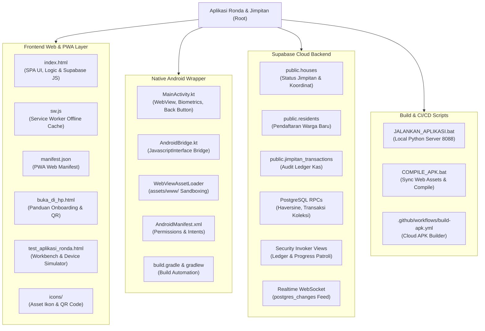
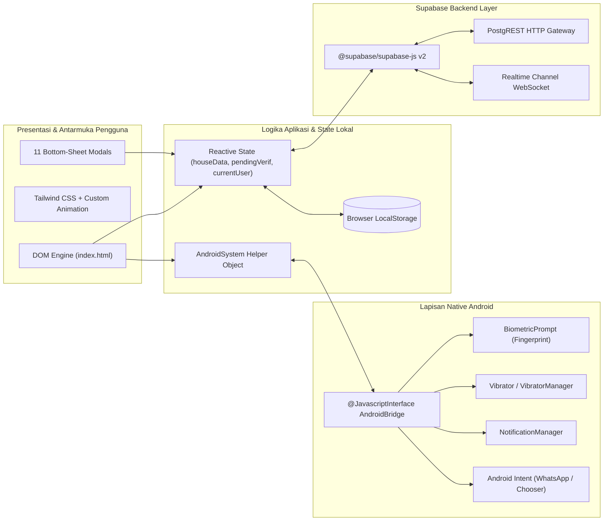
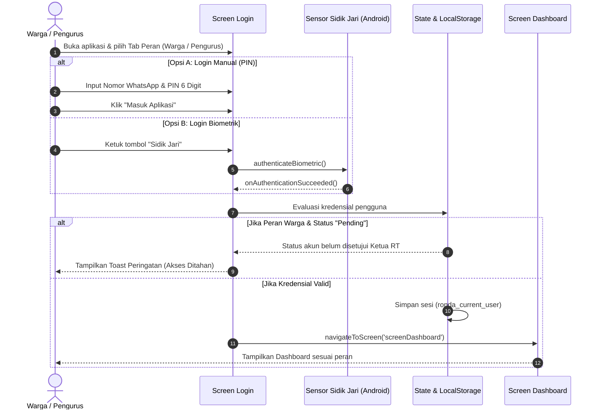
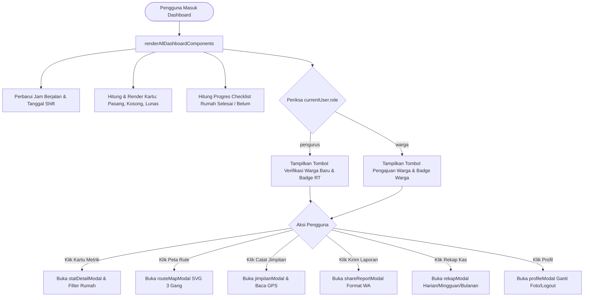
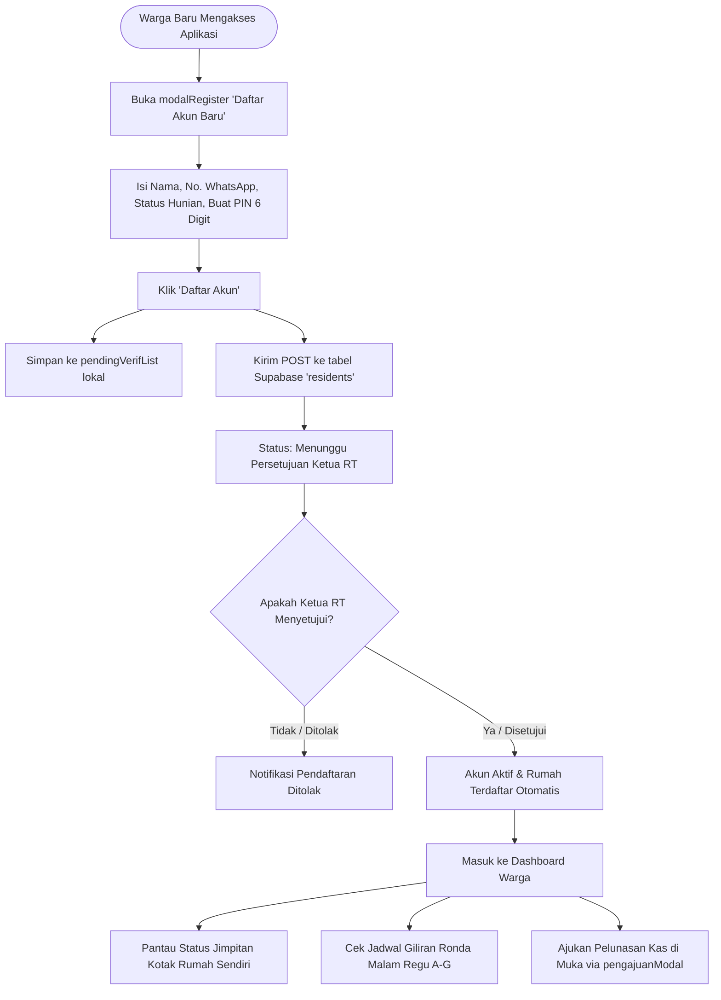
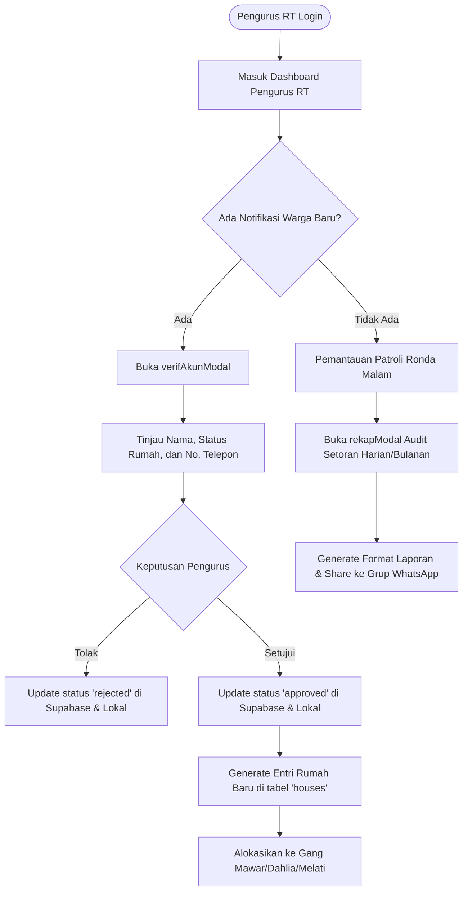
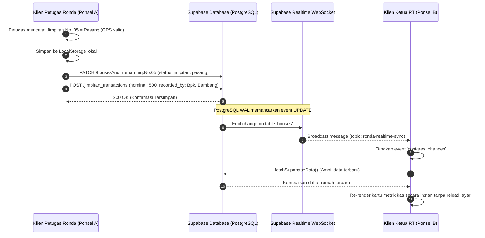
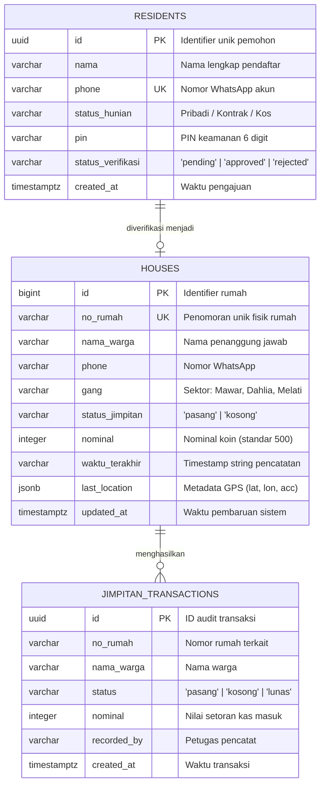
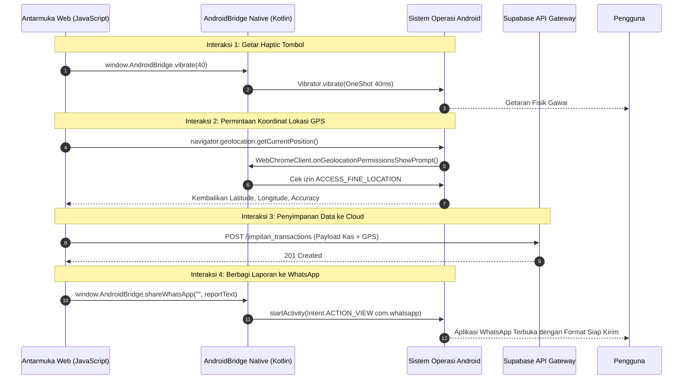

# Peta Arsitektur & Alur Proyek (Project Map)

Dokumen ini menyajikan peta komprehensif dari **Aplikasi Ronda & Jimpitan Warga RT 01 / RW 02 Kelurahan Bener** menggunakan visualisasi diagram Mermaid untuk memfasilitasi audit menyeluruh oleh Software Architect.

---

## 1. Peta Struktur Proyek (Project Structure Map)

---

## 2. Hubungan Antar Modul (Module Relationship Map)

---

## 3. Alur Autentikasi & Login (Login Flow)

---

## 4. Alur Kerja Dashboard (Dashboard Lifecycle Flow)

---

## 5. Alur Pengguna: Warga Biasa (User / Warga Flow)

---

## 6. Alur Pengguna: Pengurus RT (Admin / Pengurus Flow)

---

## 7. Alur Sinkronisasi Supabase (Cloud Synchronization Flow)

---

## 8. Relasi Entitas Basis Data (Database ERD Flow)

---

## 9. Alur Pemanggilan API & Native Bridge (API & Bridge Interaction Flow)

